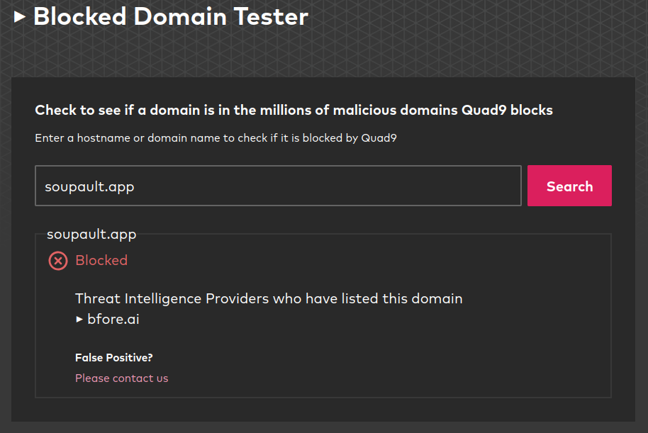
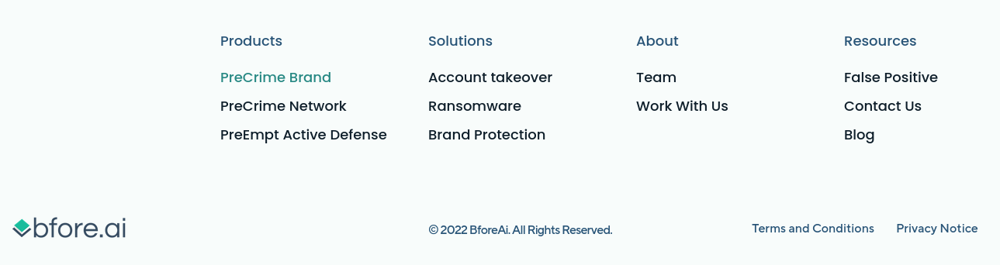
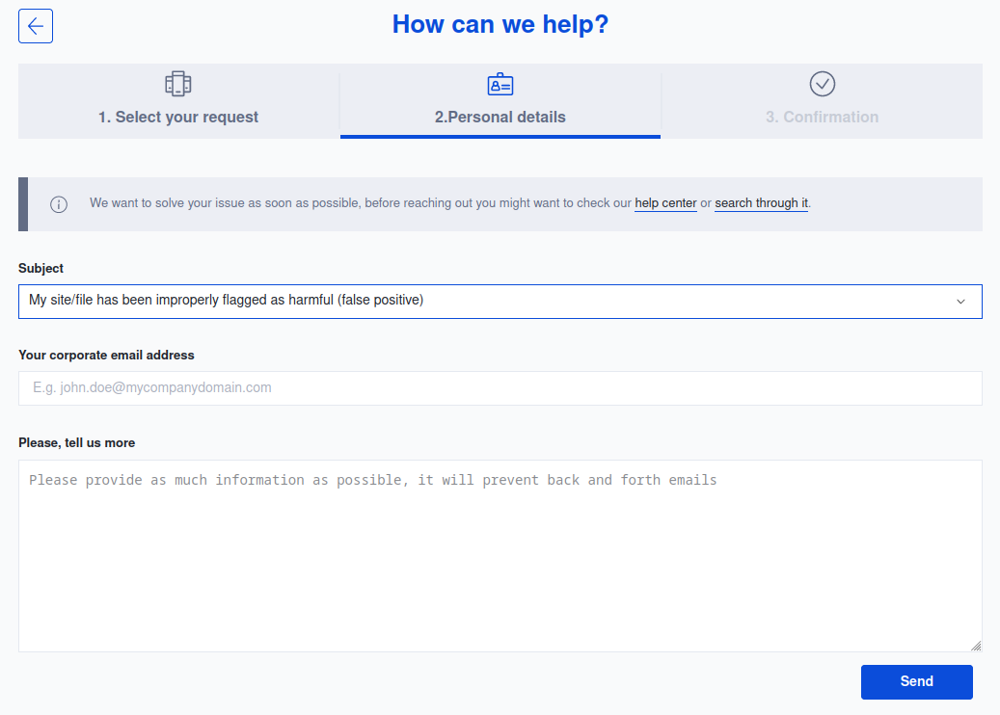
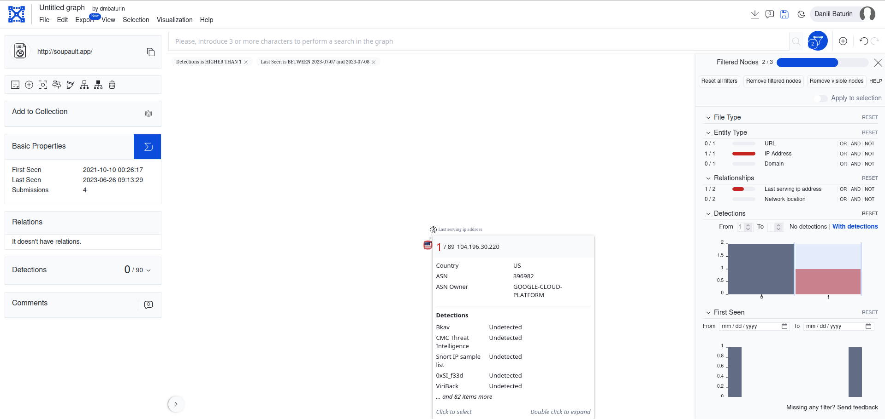

<h1 id="post-title">Mistaken for malware</h1>

Date: <time id="post-date">2023-07-07</time> 

For a few days a couple of weeks ago, soupault's website was unavailable at the soupault.app address
to users of Quad9 and some other public DNS services. The reason was that certain security service and software vendors
incorrectly classified it as malicious. Now that the situation is resolved, it's time to talk about my experience
of interaction with those vendors.

 

<h2 id="block">soupault.app getting blocked by public DNS servers</h2>

On 2023-06-21, a user (that was [toastal](https://toast.al/) — thanks to him!) told me that [soupault.app](https://soupault.app)
was unavailable to him. After I told him that it was working for me, we tracked the problem down to the public DNS server he used.
[Quad9](https://www.quad9.net/) wasn't resolving the soupault.app domain.

At first, we thought it might be a blanket issue with .app — there was quite some backlash against those Google's TLDs
when they, arguably, crossed the line with .zip that became an instant hit with phishers.
But it wasn't the case — soupault.app was blocked explicitly.

Well, as a good-faith actor, what can I make out of that block page? First, I find it appalling that Quad9 makes domain blocks
look like problems on the website's own side. Users who aren't so technical will likely just wait for it to come back online
instead of notifying the website owner. Well, even if they want to report it to the owner, they have no way to do it
if they don't know how to reach the owner (or are ready to look up an archived contacts page in the Wayback Machine).

Second, there's absolutely no indication of what kind of problems I should look for. Let's assume that my website was compromised.
How do I start investigation to mitigate the threat? Did anyone put malware files on my website? Was the backend turned into a botnet C&C node?
Are there phishing pages? Anything else?

I was convinced that it was a false positive, but I still had to take the situation seriously and verify that it wasn't compromised.

<h2 id="investigation">The investigation</h2>

Luckily, the website has a very small attack surface. Since it's completely static (it's a showcase for soupault's capabilities, after all),
a compromised web backend simply wasn't a logical possibility. It's hosted on Netlify and built with
[GitHub Actions](https://github.com/PataphysicalSociety/soupault.app/blob/main/.github/workflows/main.yml)<fn id="netlify-apt">The reason
why I do not use Netlify's built-in CI is that it <a href="https://github.com/netlify/build-image/issues/519">doesn't allow installing custom packages</a>
in build containers, for a reason that is beyond me. That makes it impossible to install the tools I want to use in the website build process,
such as an external syntax highlighter.</fn>
so there were only two options: either the GitHub repo was compromised or the Netlify account was.

I could easily verify that both were secure. The repo didn't have any commits I didn't make, and all deploys in my Netlify account
were clearly linked to GitHub Action runs.

So, there was the last possibility — soupault executables infected with malware. A supply chain attack on the OPAM repository
would be quite difficult to execute, since there's no self-service upload there. People contribute packages by [sending patches to the git repo](https://opam.ocaml.org/doc/Packaging.html),
and packaging files include hash sums of source archives.

But nothing is completely impossible, so I went to check the latest [4.6.0 release](https://soupault.app/blog/soupault-4.6.0-release) with [VirusTotal](https://virustotal.com/).
I started with the Windows executable, then went on to check the macOS one — both checks turned out clean. Then I checked the Linux executable for the sake of completeness.
To my utmost surprise, that check was positive — BitDefender Theta thought it was infected with [Mirai](https://en.wikipedia.org/wiki/Mirai_(malware)).

That immediately smelled like a false positive to me. First, no other vendor detected anything, not even BitDefender's other product.
Nonetheless, I carefully looked at the output of `strace` for soupault 4.6.0 running on a clean VM — there were no system calls I wouldn't expect,
certainly no network connections to a C&C server. I downloaded samples of actual Mirai executables and compared `strings`, `objdump -d` and `hexdump` listings just to be sure —
there certainly wasn't anything like that in my executables. Mirai samples that I could find used `wget | sh` to fetch their "updates".
Soupault executables didn't contain any domain names other than soupault.app (in help messages and default configs), and there was no code that could make network connections.

I assumed that the BitDefender mis-detection was a likely cause of the domain block, so I decided to try some options to make the Linux executable pass the check.
I found that when I ran `strip` on it, it was no longer detected as malware. That was also the final confirmation that it was a false positive — whatever caused BitDefender Theta
think it was infected, it wasn't even in the ELF sections that actually determined program's behavior.

I intentionally distribute soupault executables unstripped so that users can get informative exception traces if there are any bugs that lead to unhandled exceptions.
I found that compiling with GNU libc instead of musl also made it pass the test, so I had two last resort options: give up the debug information or give up truly static Linux executables.

Neither options seemed like an acceptable compromise, so I decided to contact the vendors first. Besides, it wasn't even clear if that mis-detection was the real root cause of the blocks,
or an unrelated thing (an epiphenomenon, as my good friend likes to say).

<h2 id="vendors">Communicating with security vendors</h2>

<h3 id="quad9-communication">Quad9</h3>

The first vendor I contacted was Quad9, since it was the first one to block the domain. By then, Google DNS was also blocking it,
but at least Quad9 had a handy contact form.

I sent them a detailed report on my findings, you can find a copy of it in the [mailing list](https://lists.sr.ht/~dmbaturin/soupault/%3C5c63f8bec99a71e723e3225cd1e58cd9%40aoirthoir.com%3E#%3C9b32157c-8866-86d8-9b82-9d5d458a009f@baturin.org%3E).

I received a reply within the same day from them.

<blockquote>
Hello Daniil,
 
Thanks for contacting Quad9 support.
 
We appreciate the detailed information.
 
This appears to be a false positive, and will be removed from the blocklist of all global servers within 4 hours.
</blockquote>

I'm certainly not happy with their approach to blocking, but at least their support was helpful.

<h3 id="bfore-communication">Bfore.ai</h3>

Since the block was initiate by [Bfore.ai](https://bfore.ai), I had to contact them to get the block removed from all places that used their block lists.
Well, a good thing is that they have a link clearly labeled "False positive" on every page, and it leads to a [web form](https://bfore.ai/support/).

I also received a reply within 24 hours and they also removed the block. However, they refused to admit that it was a false positive.

<blockquote>
Hello Daniil

Based on your feedback we have removed the malicious flag indication from VirusTotal, Quad9 and other partners block lists.

This was not a false positive, we identified common behavior with other malicious servers a few weeks ago, our prediction engine flags immediately to protect our customers. 
We upload the information to Virus Total 2 to 4 weeks later to help the cybersecurity community identify risks and fight back. VirusTotal is not supposed to be used as a deny list (according to their T&Cs) and we have no control on the downstream use of information that is provided to VT free of charge.

Please beware, shall our prediction engine observe again signals of malicious behavior the flag will be reinstated to protect our customers from network intrusions.

note : We only provide domains/subdomains verdicts to VirusTotal (eg. bfore.ai) in certain cases an URL (eg. https://bfore.ai) might still be flagged as malicious till VirusTotal rescan the same - you might initiate rescan manually by clicking on the relevant icon on the right end of status bar that says "... security vendors flagged this URL as malicious" )

Thanks for your report, best regards.
</blockquote>

And, again, as a good-faith actor, I got no actionable information out of it. What was the alleged "common behavior with other malicious servers"?
What can I do to prevent such incidents? Why don't _you_ want to know how to improve your product to prevent false positives in the future?

<h3 id="bitdefender-communication">BitDefender</h3>

BitDefender was the worst offender of all (excuse the pun). First, there's no contact information on their website _anywhere_ in sight.
I had to resort to contacting VirusTotal, which has a contact form on the website and there's an excplicit "false positive" category there.

I made it very clear that I understood that VirusTotal was just an aggregator and wasn't responsible for any false positives, and I asked them to either communicate
my findings to BitDefender or point me to their contact information. They shared a list of vendors' virus submission email addresses with me,
so finally I could send my report to BitDefender.

I haven't received any reply within these two weeks, but by the end of the second week, BitDefender Theta was no longer detecting soupault 4.6.0 as malicious.
Well, better than nothing, I suppose.

<h2 id="guild-by-association">Guilt by association?</h2>

While poking around VirusTotal, I discoverd that, for registered users, it has a "Graph" feature. The graph for soupault.app shows an association
with its IP address, which belongs to Google Cloud Platform (where Netlify hosts its web servers), and has a history of detections as malicious.

Since Bfore.ai agreed to remove the block while the BitDefender mis-detection was still in force, I suppose those issues might indeed be unrelated
and the real reason for the block was that someone hosted an actually malicious website on Netlify (which isn't unlikely), and Bfore.ai decided to block
all domains whose A records resolved to that address.

If so, that would be a 1995 reasoning, completely unacceptable in a world of virtual hosts and SNI.

<h2 id="conclusion">Conclusion</h2>

Well, at least now all the blocks and false positives are removed. Besides, soupault is a completely offline program, so people only need its website
to download it and to read the documentation. It's not even that popular (yet). Nothing really bad happened, apart from a minor annoyance for the users
and a major annoyance for me.

However, the whole story left a very bitter aftertaste. Email spam detection industry has had all those problems for a while already,
but this is a whole next level of presumption of guilt, lack of any transparency, and hostility towards good-faith actors.

If Quad9 and friends redirected users to a page with a "malicious website blocked" message, users could understand what was going on
and try to contact the owners, but those services choose to keep them in the dark by returning a SERVFAIL or NXDOMAIN.

If Bfore.ai was so smart with its AI, it could easily add heuristics that would hint that a suspected website
was compromised or mis-detected, such as an old domain, an otherwise well-behaved website, and proper whois information.
They could also easily generate notifications for domain owners to tell them that their websites might be compromised.
But they don't bother — all they do is silent blocking without any explanations.

If the "guilt by association" theory is correct, it's an argument for self-hosting. Operating a server with a static website is simple enough,
and you only need to check that the server is alive, not that you aren't blocked by a bunch of vendors you haven't even heard about.

I'm not sure what my steps to prevent such issues in the future will be. One idea is to bundle the reference manual with releases so that people can still have it
even if the website disappears completely. The technology to do that is already there: I wrote an [asset inlining plugin](https://github.com/dmbaturin/iproute2-cheatsheet/blob/master/plugins/inline-assets.lua)
to make the [iproute2 guide](https://baturin.org/docs/iproute2/) completely self-contained. The same approach can be used to build a single-page HTML manual
with all images and styles embedded into it.

Otherwise, at least everything is back to normal now.

<h2 id="ps">Post scriptum</h2>

This post got quite popular on [Lobsters](https://lobste.rs/s/uxvgkc/mistaken_for_malware). Then, on 2023-07-08, I received a new message from the Bfore.ai support team:

<blockquote>
Thank you for sharing your concerns about the incident involving the flagging of your domain, soupault.app. We have thoroughly investigated the situation and confirmed that it was indeed a false positive. We sincerely apologize for any inconvenience caused.

Regarding the reason for the flagging, it appears that an unrelated malicious website hosted on Netlify triggered the block, leading to the false positive detection. We understand the impact this had on your domain and we assure you that we are working to improve our processes to prevent such incidents in the future.

We appreciate your efforts in conducting an investigation to ensure the security and integrity of your website. It is essential for domain owners to take such matters seriously, and we value your commitment to maintaining a safe online environment.

At our organization, we are committed to promoting a safer web environment.
We recognize the importance of providing clear and detailed explanations when incidents like these occur. We will take your feedback into consideration and work towards improving our communication processes to provide more context and guidance in similar situations in the future.

Once again, we apologize for any inconvenience caused, and we appreciate your understanding and patience throughout this incident. If you have any further questions or concerns, please don't hesitate to reach out to our support team. We value your feedback and are committed to continuously improving our services.
</blockquote>

I also received a personal message from Luigi Lenguito, Bfore.ai CEO, who had read this post and thanked me for the opportunity to reduce the rate of false positives.

In short,

* Bfore.ai admitted that it _was_ a false positive — I'm happy that they did, but I feel uneasy about the fact that it took a minor media outrage.
* The root cause _was_ "guilt by association" — being hosted on a shared hosting or a CDN is _still_ a risk factor (people on Lobsters confirmed that in comments).
* I hope that there indeed will be fewer false positives of this nature in the future and that maybe security vendor communication with website owners will improve as well.
