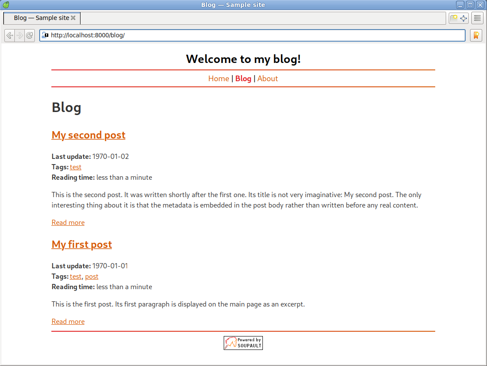
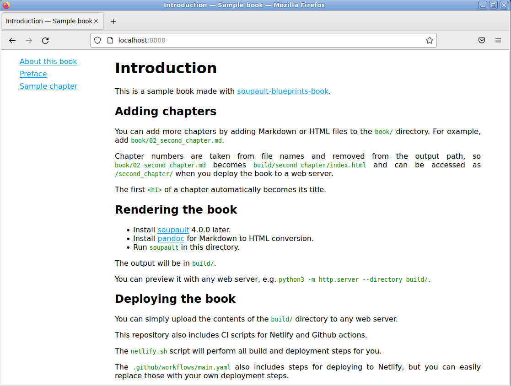
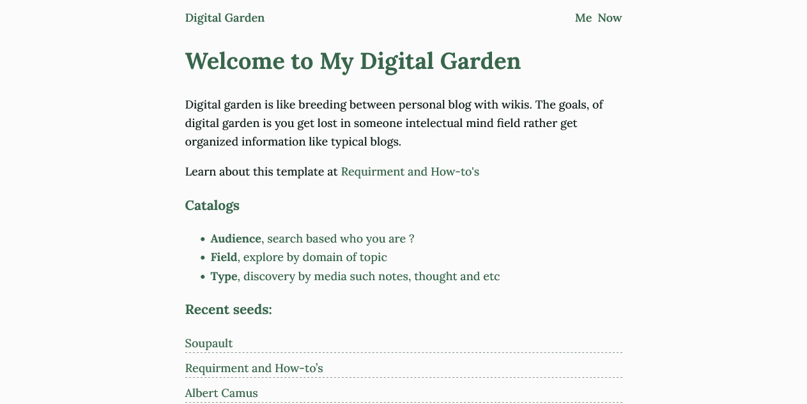

# Blueprints

 

Blueprints are ready-to-use soupault setups that you can take and start building upon.

Since soupault doesn't have a built-in content model and allows the user to define it from scratch,
setting up a website from scratch can be a daunting task for beginners.

To help people set up new websites quickly, the soupault community provides
a set of "blueprints". Each blueprint is a set of a soupault config,
plugins, HTML templates, CSS styles, sample data for demonstration
and usage instructions.

They serve the same purpose as "themes"	in other static	site generators,
though they openly admit that they aren't interchangeable visual themes,
but rather applications on top of the soupault framework,
written to make their visual design easy to change. 

## Blog

This blueprint implements a blog with features you'd expect from a blog:
post lists, tags, Atom feeds (global and per-tag).

You can see a modified version at [baturin.org/blog](https://baturin.org/blog).

* Codeberg: <codeberg>PataphysicalSociety/soupault-blueprints-blog</codeberg>
* GitHub: <github>PataphysicalSociety/soupault-blueprints-blog</github>

## Book

This is a blueprint for online books comparable to [mdBook](https://rust-lang.github.io/mdBook/).

The sidebar with a list of chapters is generated completely automatically. There's no need to write a ToC/summary of the book by hand.
Chapter numbers are taken from file names. In the sample setup, there are book/00_preface.md and book/01_sample_chapter.md.

For a live version, check out the [OCaml From the Ground Up](https://ocamlbook.org) book.
It also features automatic type checking for OCaml code snippets, so if you are writing a programming book,
you can use it for inspiration.

* Codeberg: <codeberg>PataphysicalSociety/soupault-blueprints-book</codeberg>
* GitHub: <github>PataphysicalSociety/soupault-blueprints-book</github>

## Digital Garden

This is a blueprint implementing digital garden, combination of blog and wikis. Inspired from [fromjason.xyz](https://fromjason.xyz) garden.

You can see this template in action at [Digital Garden in Soupault](https://upgraded-octo-computing-machine.vercel.app/).

* GitHub: <github>multidecay/soupault-digital-garden</github>

