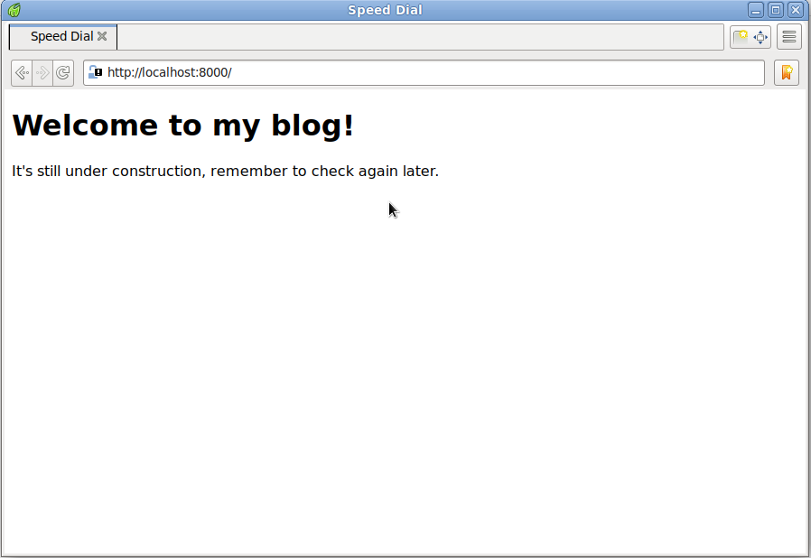
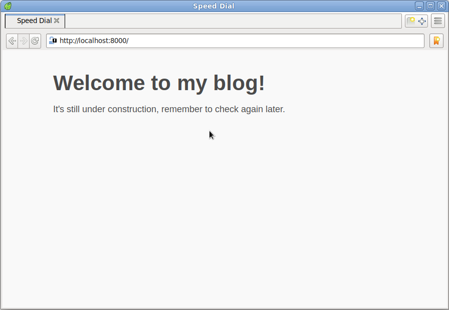
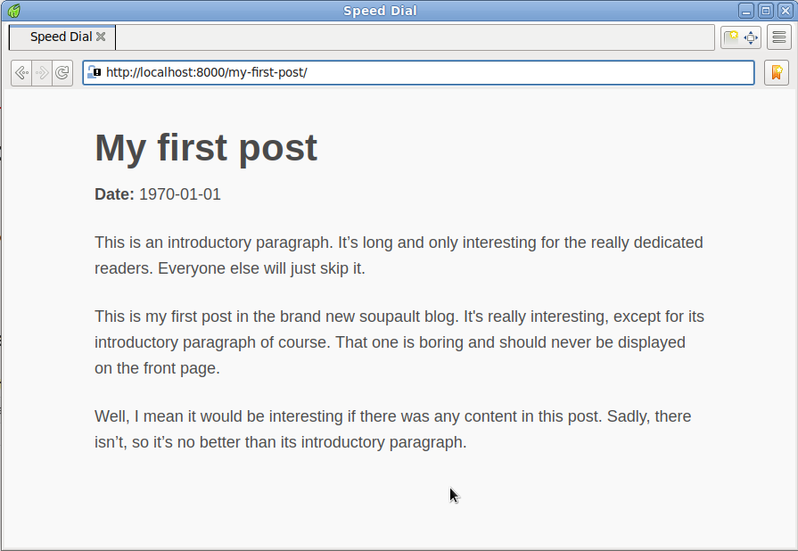
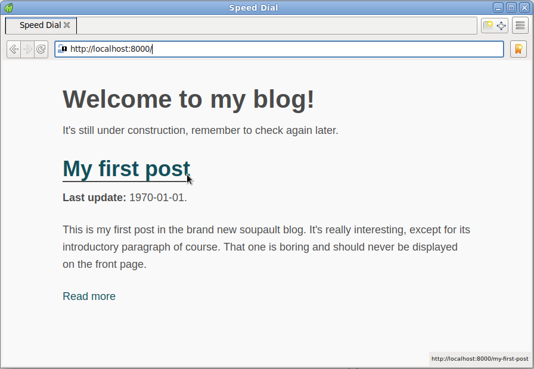
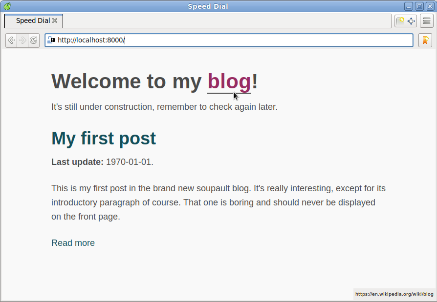

# Quick start

<div id="generated-toc"> </div>

In this tutorial we will create a simple blog with soupault.

Note that there’s a `soupault --init` option that creates a very basic project,
but we’ll do everything by hand for the sake of learning.

## Initial configuration

Some projects claim to be "zero configuration". In practice it often means they just force
a hardcoded convention on you. Soupault is a polar opposite: nearly every aspect is configurable.

The configuration file is in the [TOML](https://toml.io) format. You can use `soupault.toml`
file name (recommended) or `soupault.conf`.

Create a directory for your blog project (say `my-blog/`) and save the following to
`my-blog/soupault.toml`:

```toml
[settings]
  # Stop on page processing errors?
  strict = true

  # Display progress?
  verbose = true

  # Display detailed debug output?
  debug = false

  # Where input files (pages and assets) are stored.
  site_dir = "site"

  # Where the output goes
  build_dir = "build"

  # Pages will other extensions are considered static assets
  # and copied to build/ unchanged
  page_file_extensions = ["htm", "html", "md", "rst", "adoc"]

  # Files with these extensions are ignored.
  ignore_extensions = ["draft"]

  # Treat files as content to insert in the template,
  # unless they have an <html> element in them.
  generator_mode = true
  complete_page_selector = "html"

  # Use templates/main.html file for the page template.
  default_template_file = "templates/main.html"

  # The content will be inserted into its <main> element,
  # after its last already existing child.
  default_content_selector = "main"
  default_content_action = "append_child"

  # Set the document type to HTML5, unless the page already has
  # a doctype declaration.
  doctype = "<!DOCTYPE html>"
  keep_doctype = true

  # Indent HTML tags for readability
  pretty_print_html = true

  # Translate site/about.html to build/about/index.html
  # If set to false, then site/about.html will become build/about.html
  clean_urls = true

  # Look for plugin files in plugins/
  plugin_discovery = true
  plugin_dirs = ["plugins"]

```


## Directory structure

With the config above, we will store our content in the `site/` directory.

We’ll also need a directory named `templates/` to store the default template.
We’ll also create `plugins/` directory to store plugins right away—we’ll get to it later.

```
cd my-blog
mkdir site/
mkdir templates/
mkdir plugins/
```

## Setting up the page template

In the soupault parlance, a "page template" is simply a page without content. It inserts the content by
manipulating the HTML element tree rather than by replacing a template tag like `{{content}}`.

If you have experience with other SSGs like Jekyll or Hugo, you might have expected to see
how to set up a theme. Soupault doesn’t have themes in the same sense.

The problem is that "theme" for a CMS or a "classic" SSG is something of a misnomer:
the word sounds as if it’s just about the looks, but in reality it’s a mix of presentation and logic,
and different themes are rarely interchangeable. They abstract away a lot of complexity,
but also give you less control, and when you want something a theme doesn’t have built-in,
you have to learn how it works before modifying it.<fn>And you will lock yourself out of easy updates
to new versions of that theme if you modify it, not to mention the that themes may also break
from upgrading to a new SSG version.</fn>

Soupault gives you total control over your page assembly process, at cost of a bigger initial setup effort.
For this tutorial, we’ll start with a very simple page.

```html
<html>
  <head>
    <meta charset="utf-8">
    <meta name="viewport" content="width=device-width, initial-scale=1">
  </head>
  <body>
    <main>
      <!-- content will go here -->
    </main>
  </body>
</html>
```

Save it to `templates/main.html`.

## Create a content file in HTML

The only format soupault supports _natively_ is HTML. For the start we’ll create the index page of our site.

Create a file named `site/index.html` and write some HTML in it, for example:

```html
<h1>Welcome to my blog!</h1>
<p>It’s still under construction, remember to check again later.</p>
```

## Build the website

Simply run `soupault` without any options in your project directory. Since we set `verbose = true` in the config,
it will display the build progress.

```shell-session
$ soupault
[INFO] Build directory "build" does not exist, creating
[INFO] Processing page site/index.html
[INFO] Using the default template for page site/index.html
```

Now let’s look at the generated `build/index.html` page:

```html
$ cat build/index.html 
<!DOCTYPE html>
<html>
 <head>
  <meta charset="utf-8">
  <meta name="viewport" content="width=device-width, initial-scale=1">
 </head>
 <body>
  <main>
   <h1>
    Welcome to my blog!
   </h1>
   <p>
    It’s still under construction, remember to check again later.
   </p>
  </main>
 </body>
</html>
```

As you can see, the content of `site/index.html` was injected into the `<main>` element, as per the `content_selector` option.

## View the site

Soupault doesn’t include a built-in web server. You need to bring your own, and there’s a wide choice of them.

Nearly every UNIX-like system ships with Python today,
and you can make the `build/` directory available over HTTP with `python -m http.server --directory build/`
<fn>That also works on Windows, but need to install Python first of course</fn>.

If you don’t like Python’s web server, there are many small web server projects around.

I’ll use Python:

```shell-session
$ python3 -m http.server --directory build
Serving HTTP on 0.0.0.0 port 8000 (http://0.0.0.0:8000/) ...
```

For viewing the site, I’ll use [Midori](https://github.com/midori-browser) just to be obnoxiously vendor-neutral.



## Add some CSS

Of course, it’s a completely unstyled page. Let’s make it look better.

[Sakura](https://oxal.org/projects/sakura/) is a classless CSS framework that provides a much nicer default style than browsers do.

First we need to save the stylesheet to `site/`. Since its extension is `.css`, which is not in the `page_file_extension` list,
soupault will simply copy it to the `build/` directory unchanged. There is no need to have a separate directory for assets.

```
wget https://raw.githubusercontent.com/oxalorg/sakura/master/css/sakura.css -O site/sakura.css
```

Now we need to link the stylesheet to our pages. We could just edit `templates/main.html` and add it by hand,
but instead we’ll make soupault insert it for us.

We will use the `insert_html` widget for that. A soupault _widget_, for lack of a better word, is an HTML processing function.
There’s a bunch of [built-in widgets](/reference-manual/#widgets) and you can add new widgets by installing plugins.

Add the following at the end of your `soupault.toml`:

```toml
[widgets.insert-sakura-css]
  widget = "insert_html"
  selector = "head"
  html = """ <link rel="stylesheet" href="/sakura.css" type="text/css"> """
```

This means "insert this HTML snippet into the element that matches CSS3 selector `head`, which is `<head>`".

Now let’s build and view the site. You will see a new message in the log: `Processing widget insert-sakura-css on page site/index.html`.

```shell-session
$ soupault
[INFO] Processing page site/index.html
[INFO] Using the default template for page site/index.html
[INFO] Processing widget insert-sakura-css on page site/index.html
```

And the site will have some basic style now:



## Add Markdown support

Most static site generators have built-in support for Markdown. Soupault doesn’t—it allows you to bring your own
Markdown tools. Or any other tools for that matter: if you are a fan of reStructuredText, AsciiDoc, or any other
format that can be converted to HTML, you can use it with soupault.

The main reason not to have Markdown built-in is that there’s no single Markdown standard really.
And even among implementations of CommonMark, the HTML output isn’t exactly the same.

Soupault solves that problem using [page preprocessors](/reference-manual/#page-preprocessors). Any program that
reads data from stdin and writes HTML to stdout can be used as a preprocessor.

For example, we can use [Pandoc](https://pandoc.org)—a popular tool that supports multiple formats, including
CommonMark.

Add this to your `soupault.toml`:

```toml
[preprocessors]
  md = 'pandoc -f commonmark+smart -t html'
```

## Add a post

We are making a blog, remember? Now that we have the basic set up, let’s add our first post.

Save the following to `site/my-first-post.md`.

```
# My first post

<time id="post-date">1970-01-01</time>

This is an introductory paragraph. It’s long and only interesting for the really dedicated readers.
Everyone else will just skip it.

<p id="post-excerpt">
This is my first post in the brand new soupault blog. It’s really interesting, except for its
introductory paragraph of course. That one is boring and should never be displayed on the front page.
</p>

Well, I mean it would be interesting if there was any content in this post. Sadly, there isn’t,
so it’s no better than its introductory paragraph.
```

Later you’ll see why we included that boring introductory paragraph. For now let’s build the
site and look at the post.

If you are familiar with another SSG like Hugo or Jekyll, you might also have noticed that the post
doesn’t have “front matter”. This is intentional, we’ll get to it in the next section.

When you build the site, you will see a new log message: `Calling preprocessor pandoc -f commonmark+smart -t html on page site/my-first-post.md`.

```shell-session
$ soupault
[INFO] Processing page site/my-first-post.md
[INFO] Calling preprocessor pandoc -f commonmark+smart -t html on page site/my-first-post.md
[INFO] Using the default template for page site/my-first-post.md
[INFO] Processing widget insert-sakura-css on page site/my-first-post.md
[INFO] Processing page site/index.html
[INFO] Using the default template for page site/index.html
[INFO] Processing widget insert-sakura-css on page site/index.html
```

You will not see the post on the front page yet. To view it, you need to navigate to
`/my-first-post`.



## Define a content model

We have a post now, but not a way to generate a blog index yet. Before we can generate a blog index,
we need to define a content model first.

Remember that the post doesn’t have front matter? It’s because soupault extracts metadata directly from HTML.
Back when the Internet was still actually decentralized, that idea was known as [microformats](https://microformats.org).
In a sense, soupault allows you to create your own microformats as you go.

Soupault also doesn’t have any built-in content model. You need to define a mapping of metadata fields
to CSS3 selectors of elements they should be extracted from.

For our blog we’ll use the following fields:

* Title
* Date
* Excerpt

Add the following to your `soupault.toml`:

```toml
[index.fields.title]
  selector = ["h1"]

[index.fields.date]
  selector = ["time#post-date", "time"]
  extract_attribute = "datetime"
  fallback_to_content = true

[index.fields.excerpt]
  selector = ["p#post-excerpt", "p"]

```

Now I’ll explain what it all means.

The HTML element naturally suited for the post title is `<h1>`, so we just use `h1` selector.

Date is more interesting: the HTML element
`<datetime>` is supposed to store the actual date in its `datetime=""` attribute rather than in the content,
but soupault has an option to do that: `extract_attribute`. The `fallback_to_content` option defines
whether it will extract the content of the element if it can’t fine the attribute,
or just leave the field empty.

Finally, it’s possible to specify _multiple_ selectors for each field. Remember the boring introductory
paragraph in the post? It’s followed by a paragraph starting with `<p id="post-excerpt">`.
By adding `selector = ["p#post-excerpt", "p"]` to the field config

Now we also need to enable index extraction and setup sorting settings:

```toml
[index]
  index = true

  sort_descending = true
  sort_type = "calendar"
  sort_by = "date"

  date_formats = ["%F"]
```

The `"date"` part in the `sort_by = "date"` option is not a magical hardcoded value: it refers to the
field we defined in the `[index.fields.date]` subtable.

The `"calendar"` part in the `sort_type` option, however, _is_ magical, it’s one of the three allowed

sort types: "calendar", "lexicographic", and "numeric". The `date_formats = ["%F"]` refers to the
ever-popular `YYYY-MM-DD` format.

## Add an index view

The `[index.fields]` settings define what to extract, but not how to render the extracted data.

To render the data we’ll need to add an [_index view_](/reference-manual/#index-views). You can define multiple index views
to present the metadata in different ways. We’ll define only one simple view.

Add the following to your `soupault.toml`:

```toml
[index.views.blog]
  index_selector = "#blog-index"
  index_item_template = """
    <h2><a href="{{url}}">{{title}}</a></h2>
    <p><strong>Last update:</strong> {{date}}.</p>
    <p>{{excerpt}}</p>
    <a href="{{url}}">Read more</a>
  """
```

The `index_item_template` is the simplest way to do index rendering: it’s a [Jingoo](http://tategakibunko.github.io/jingoo/)
template applied to every item. We could also supply a complete template for rendering the entire list of entries,
of write an external rendering script, but let’s stick with the basics for now.

Thus we need to update the `site/index.html` page:

The `index_selector = "#blog-index"` option means soupault will check if a page has an element with
`id="blog-index"`. If it does, rendered index will be inserted inside that element.

```html
<h1>Welcome to my blog!</h1>
<p>It’s still under construction, remember to check again later.</p>

<div id="blog-index">
  <!-- blog index will be inserted here -->
</div>
```

Now it’s time to build our site. We’ll use `soupault --debug`, since debug output includes the index metadata:

```shell-session
$ soupault --debug
[DEBUG] Widget processing order: insert-sakura-css
[INFO] Processing page site/my-first-post.md
[INFO] Calling preprocessor pandoc -f commonmark+smart -t html on page site/my-first-post.md
[INFO] Using the default template for page site/my-first-post.md
[INFO] Processing widget insert-sakura-css on page site/my-first-post.md
[INFO] Processing page site/index.html
[INFO] Using the default template for page site/index.html
[INFO] Inserting section index
[INFO] Rendering index view "blog" on page site/index.html
[INFO] Generating section index
[DEBUG] Index data (pretty-printed): [
  {
    "url": "/my-first-post",
    "page_file": "site/my-first-post.md",
    "nav_path": [],
    "excerpt": "This is my first post in the brand new soupault blog. It’s really interesting, except for its\nintroductory paragraph of course. That one is boring and should never be displayed on the front page.",
    "date": "1970-01-01",
    "title": "My first post"
  }
]
```

And let’s look at the front page.



## Install a plugin

Soupault is extensible with Lua plugins. You can find a selection in the [/plugins](/plugins/) section.

For demonstration we’ll install the [Quick Links](/plugins/#quick-links) plugin. If you used another SSG before,
you may be familiar with “shortcodes”—template tags that allow you to easily insert snippets of HTML code, e.g.
`{{wikipedia|page=Blog}}`.

That plugin is conceptually similar, but it uses ‘fake’ HTML elements instead of template tags and translates
them to real valid HTML.

First, create a `plugins/` directory (if you haven’t created it already) and download the plugin:

```shell-session
$ mkdir plugins/
$ wget https://soupault.app/files/plugins/quick-links.lua -O plugins/quick-links.lua
```

Since we have plugin discovery enabled in `[settings]`, soupault will automatically find a new `quick-links` widget
based on the `quick-links.lua` file name.
We still need to add it to the config to activate it, and we can also set the default Wikipedia language there.

Add this to your `soupault.toml`:

```toml
[widgets.quick-links]
  widget = "quick-links"
  wikipedia_default_language = "en"
```

Now let’s update out `site/index.html` page to use the `<wikipedia>` tag:

```html
<h1>Welcome to my <wikipedia>blog</wikipedia>!</h1>
<p>It’s still under construction, remember to check again later.</p>

<div id="blog-index"> </div>
```

When you build the site, you will see messages about the new widget in the logs.

```shell-session
$ soupault
[INFO] Processing page site/my-first-post.md
[INFO] Calling preprocessor pandoc -f commonmark+smart -t html on page site/my-first-post.md
[INFO] Using the default template for page site/my-first-post.md
[INFO] Processing widget quick-links on page site/my-first-post.md
[INFO] Processing widget insert-sakura-css on page site/my-first-post.md
[INFO] Processing page site/index.html
[INFO] Using the default template for page site/index.html
[INFO] Inserting section index
[INFO] Rendering index view "blog" on page site/index.html
[INFO] Generating section index
[INFO] Processing widget quick-links on page site/index.html
[INFO] Processing widget insert-sakura-css on page site/index.html
```



## What’s next?

There are many more things you can do with soupault:
dump the metadata to JSON; specify dependencies between widgets and use one widget’s
output as another’s input; you can generate tables of contents and footnotes
in a highly flexible way… And you can write your own Lua plugins to manipulate
pages in completely arbitrary ways.

Consult the [reference manual](/reference-manual/) for details.

<hr>
<div id="footnotes"> </div>
